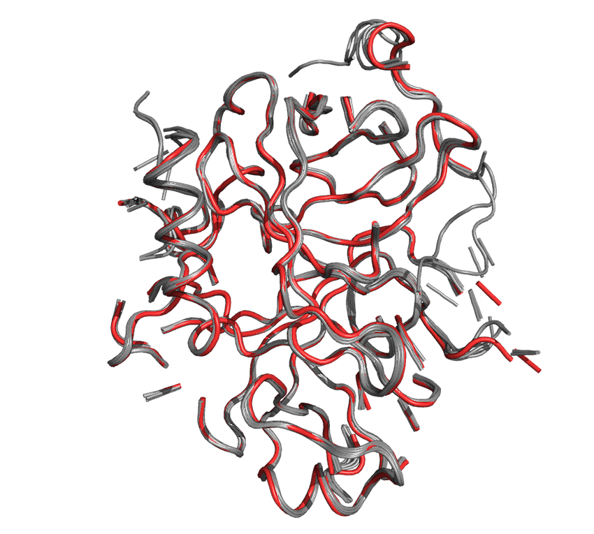
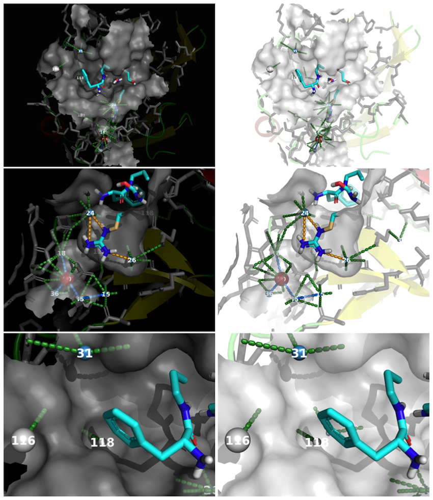

## Introduction

The ability to identify conserved waters from a collection of related protein structues is important for gaining a better understanding of the ligand binding environment. The `vanddraabe` package is based on the work of Sanschagrin and Kuhn (_Protein Science_, 1998, **7** (_10_), pp 2054-2064. [DOI: 10.1002/pro.5560071002](http://doi.org/10.1002/pro.5560071002)) and Patel, Gruning, Gunther, and Merfort (_Bioinformatics_, 2014, **30** (_20_), pp 2978-2980. [DOI: 10.1093/bioinformatics/btu424](http://doi.org/10.1093/bioinformatics/btu424)). Expanding on WatCH and PyWATER, `vanddraabe` and returns statistical parameters for each water cluster, informative graphs, and a PyMOL session file to visually explore the conserved waters and protein along with intermediate information. 

This vignette demonstrates the steps and thought process to analyze the conserved waters of ten thrombin crystallographically determined structures and is based on the work of Sanschagrin and Kuhn (_Protein Science_, 1998, **7** (_10_), pp 2054-2064). The results presented herein are part of the original vanddraabe article. There are six main steps to determine conserved water within a collection of protein structures:

- Download PDB structures from the [RCSB](http://www.rcsb.org)
- Determine quality of structures and retain those meeting specified requirements
- Clean PDB structures
- Align structures
- Determine conserved waters
- Analyze and visualize results

Before identifying and analyzing conserved waters, several R packages need to be loaded in addition to `vanddraabe`. To aid consistency, the `filename` prefix needs to be defined. For this example `"thrombin10"` is being used. The files (PDB, Excel workbook, and PyMOL session files) and directories (folders) generated during this analysis will start with thrombin10 while the files will also include a date-time stamp to differentiate results.

```{r setup, message = FALSE}
library(vanddraabe)
library(bio3d)
library(reshape2)
library(ggplot2)
library(cowplot)

thrombin10.filename <- "thrombin10"
```


## Download PDB structures

```{r download PDBs, echo=TRUE, message=TRUE, warning=FALSE}
thrombin10.PDBids <- c("1hai", "1abj", "1ppb", "1tmb", "1hah",
                       "1tmt", "1abi", "1thr", "1ths", "1ihs")

thrombin10.PDBs <- get.pdb(ids=thrombin10.PDBids, split=FALSE, path="./thrombin10_rawPDBs")
```


## Determine structure quality

The quality of the structures impacts the results of the conserved water analysis. Often the resolution is used to define the quality of the structure but R~observed~ and R~free~ should also be taken into consideration. Smaller resolution values indicate a greater confidence in the location of atoms. Protein structures with reported resolution values greater than or equal to 3.0 Angstroms illustrate the basic contours of the protein chain and thus the atomic structure of the backbone and sidechains is inferred. The R~observed~ -- also known as R-value Observed -- value indicates how well the "modeled" atoms of the protein structure match the electron density maps with values of 0.20 or less being typical. The corresponding R~free~ value is how well a held-out collection of 5-10% of the atoms were fit; values of 0.26 or less are considered acceptable. In `vanddraabe` structures are evaluated using any combinate of the resolution, R~observed~, and R~free~. Not all structures have R~observed~ and R~free~ values reported. Only the resolution values are provided for the thrombin example presented here.

```{r RCSB quality, echo=TRUE, message=TRUE, warning=FALSE, collapse=TRUE}
thrombin10.rcsbCLEANING <- getRCSBdata(prefix = "./thrombin10_rawPDBs",
                                       resolution = 3.0,
                                       rFree = NULL,
                                       rObserved = NULL,
                                       filename = thrombin10.filename)
```

PDB structures with values greater than those provided are removed from further analysis. To remove a structural evaluation from the RCSB cleaning provide `NULL`. If no `resolution` value is provided the `CleanRCSBdataset` will automatically use `3.0`. The following information is returned:

- the [RCSB](http://www.rcsb.org) information for each PDB structure (along with being provided in an Excel workbook)
- the [RCSB](http://www.rcsb.org) information for the PDB structures _passing_ the quality requirements
- the [RCSB](http://www.rcsb.org) information for the PDB structures _**not** passing_ the quality requirements

All ten thrombin structures passed the 3.0 Angstrom resolution requirement. The following table contains some structural information for the thrombin structures.

```{r RCSB summary table, results='asis', echo=FALSE}
knitr::kable(thrombin10.rcsbCLEANING$PDB.info[, c("chainId", "resolution", "experimentalTechnique", "source", "citation", "depositionDate")], 
             caption="Portion of the RCSB Structural Information")
```


## Clean PDB structures

Protein structures from the [RCSB](www.rcsb.org) commonly do _**not**_ contain hydrogen atoms but there are the rare occurrence of hydrogen atoms being added by the depositing authors. Often atoms will be modeled -- added by the crystallographer and/or crystallographic software -- when there is not enough electron density to resolve the atom. This is common when a portion of the amino acid residue is resolved and based on the protein's sequence the "missing" portion of the residue is know. Atoms are also removed when they are assigned a B-value or occupancy value outside the normal range. B-values have a range of 0 - 100 (0 is no variation in position and 100 being diffuse; values less than 40 are considered optimal) and occupancy values have a range of 0 to 1.0 (0 being no occupancy and 1.0 being present in all reflections; values greater than 0.90 are considered optimal). 

PDB files obtained from the PDB conform to a specific set of formatting standards but this does not mean the data within the PDB files is always correct. This function _cleans_ the PDB file and summaries the atom evaluations. This function does the following (in this order):

- Reads in the PDB file
- Adds/updates the element symbol using the atom type
- Removes hydrogen atoms 
- Removes atoms with occupancy values determined to be out of range
- Removes atoms with B-values determined to be out of range
- Bins (counts) the occupancy values
- Bins (counts) the B-values
- Bins (counts) the normalized B-values
- Bins (counts) the mobility values
- Removes modeled atoms
- Removes water oxygen atoms greater than user defined value `cutoff.prot.h2o.dist` from the protein
- Writes cleaned protein structure to a PDB file

```{r clean PDBs, echo=TRUE, message=TRUE, warning=FALSE, collapse=TRUE}
thrombin10.CLEANED <- CleanProteinStructures(prefix = "./thrombin10_RCSB_passed",
                                             CleanHydrogenAtoms = TRUE,
                                             CleanModeledAtoms = TRUE,
                                             cutoff.prot.h2o.dist = 6.0,
                                             cleanDir = thrombin10.filename,
                                             filename = thrombin10.filename)
```

The information returned from cleaning the protein structure are:

- **cleaning.summary**: summary indicating
    + if hydrogen atoms were removed `TRUE/FALSE`
    + number of out of range atoms for B-values and occupancy values
    + number of modeled (and thus removed)
    + number of atoms _**NOT**_ modeled (and thus retained)
    + number of water oxygen atoms beyond the user defined cutoff
    + the number of water oxygen atoms within the user defined cutoff.
- **Bvalue.counts**: binned B-value values with binwidths = 5 (0 to 100)
- **normBvalue.counts**: binned normalized B-value values with binwidths = 0.1 (-4 to 6)
- **occupancy.counts**: binned occupancy values with binwidths = 0.1 (0 to 1)
- **mobility.counts**: binned mobility values with binwidths = 0.1 (0 to 6)
- **call**: parameters provided by the user

```{r cleaning summary table, results='asis', echo=FALSE}
knitr::kable(thrombin10.CLEANED$cleaning.summary, 
             caption="Cleaning Summary")

```

The `cleaning.summary` is a table shows there were no thrombin structures with occupancy values outside the normal range of 0 to 1 but there was a single structure, 1ppb, with 48 atoms assigned B-values outside the normal range of 0 to 100. These 48 atoms were removed from 1ppb. Three structures had atoms with occupancy values of 0.01 or less and these atoms were also removed. Four structures had water oxygen atoms beyond 6 Angstroms from a protein atom and thus these "distant" waters were removed.

```{r Bvalue summary barplot, echo=FALSE, fig.retina=2, fig.align='center', message=FALSE, warning=FALSE}
BvalueBarplot.summ(data=thrombin10.CLEANED)
```

The B-value barplots -- before the structure is cleaned -- illustrates the difference in quality of structures based on B-values. Three structures (PDBids: 1ihs, 1ppb, and 1tmt) in the Thrombin dataset have atoms with B-values of 65 or greater. Atoms with B-values greater than 60 are considered lower quality because of their greater variance. 


```{r norm Bvalue summary barplot, echo=FALSE, fig.retina=2, fig.align='center', message=FALSE, warning=FALSE}
normBvalueBarplot.summ(data=thrombin10.CLEANED)
```

Normalizing the B-values provides a way to compare B-values across a collection of protein structures; Z-score values less then 0 indicate atoms with B-values less than the mean B-value for a structure while Z-score values greater than 0 indicates and atom with B-values greater than the mean B-value. Within vanddraabe, water atoms with normalized B-values greater than 1.0 are removed from analysis. The inclusion of all atoms within the protein structures indicates the overall quality of the atoms within the structure. Normalized B-values are calculated for protein, non-protein (ligands), and water atoms separately during the evaluation of atoms prior to determining conserved waters.  

```{r occupancy summary barplot, echo=FALSE, fig.retina=2, fig.align='center', message=FALSE, warning=FALSE}
OccupancyBarplot.summ(data=thrombin10.CLEANED)
```

While a majority of the atoms in the ten protein structures have occupancy values of 1.0, only two structures (PDBids: 1ppb and 1tmt) possess atoms present in _**all**_ copies of the protein. Interestly, these two protein structures have a wider range of atom position variance. Three structures (PDBids: 1hah, 1hai, and 1thr) have modeled atoms -- those with an occupancy values of 0.01 or less. The percentage of atoms with less then perfect occupancy for these seven structures is less than XX\%.

```{r mobility summary barplot, echo=FALSE, fig.retina=2, fig.align='center', message=FALSE, warning=FALSE}
MobilityBarplot.summ(data=thrombin10.CLEANED)
```

Mobility values take into consideration the occupancy and B-values to evaluate the quality of individual atoms. Atoms with mobility values greater than 2.0 are considered lower quality. Like the normalized B-values, the mobility values are calculated for protein, non-protein (ligands), and water atoms independently during the evaluation of atoms prior to determining conserved waters.


## Align structures

The alignment of the proteins' primary sequence needs to be performed before the protein structures can be aligned. Using the "cleaned" structures, align the sequences.

```{r align sequences, eval=TRUE, message=FALSE, warning=FALSE, include=TRUE}
thrombin10.PDBs.passed <- paste("./thrombin10_CLEANED", list.files(path="./thrombin10_CLEANED/", pattern="*.pdb"), sep="/")

thrombin10.PDBs.align <- pdbaln(thrombin10.PDBs.passed, fit=TRUE)
```

Once the sequences are aligned, align the protein structures. The `stop.vol` is the "minimal core volume" to stop the structural alignment. 

```{r align PDBs, eval=TRUE, echo=TRUE, results='hide', message=FALSE, warning=FALSE}
thrombin10.core <- core.find(thrombin10.PDBs.align, write.pdbs=TRUE, rm.island=TRUE,
                             stop.vol=0.01, outpath="thrombin10_coreFind")
thrombin10.core.2.0ang.idc <- print(thrombin10.core, vol=2.0)
thrombin10.core.1.5ang.idc <- print(thrombin10.core, vol=1.5)
thrombin10.core.1.0ang.idc <- print(thrombin10.core, vol=1.0)
thrombin10.core.0.5ang.idc <- print(thrombin10.core, vol=0.5)

thrombin10.xyz.1.0 <- fit.xyz(fixed=thrombin10.PDBs.align$xyz[7, ],
                              mobile=thrombin10.PDBs.align,
                              fixed.inds=thrombin10.core.1.0ang.idc$xyz[res2xyz(c(50:59,61:96,98:128,130:196,206:220,222:256))],
                              mobile.inds=thrombin10.core.1.0ang.idc$xyz[res2xyz(c(50:59,61:96,98:128,130:196,206:220,222:256))],
                              outpath="thrombin10_fitlsq_1.0ang",
                              full.pdbs=TRUE, verbose=TRUE)
```

### Determine the quality of the alignment

```{r structural alignment quality, echo=TRUE, message=FALSE, warning=FALSE}
rmsd.fit <- rmsd(thrombin10.xyz.1.0, fit=TRUE)
rownames(rmsd.fit) <- colnames(rmsd.fit) <- sort(thrombin10.PDBids)
rmsd.fit.upper <- rmsd.fit[upper.tri(rmsd.fit)]

rmsd.NOfit <- rmsd(thrombin10.xyz.1.0, fit=FALSE)
rownames(rmsd.NOfit) <- colnames(rmsd.NOfit) <- sort(thrombin10.PDBids)
rmsd.NOfit.upper <- rmsd.NOfit[upper.tri(rmsd.NOfit)]


rmsd.diff <- rmsd.fit - rmsd.NOfit
rmsd.diff.upper <- abs(rmsd.diff[upper.tri(rmsd.diff)])


df.rmsd <- data.frame(fit=rmsd.fit.upper,
                      NOfit=rmsd.NOfit.upper,
                      diff=rmsd.diff.upper)
df.rmsd.melt <- melt(df.rmsd)
```

The alignment of the ten thrombin structures was inspected via RMSD. Two different methods of RMSD calculation were used: (_i_) _with_ coordinate superposition prior to the RMSD calculation and (_ii_) _without_. The resulting RMSD values have a correlation (r) of `r round(cor(rmsd.fit.upper, rmsd.NOfit.upper), digits=2)` and the mean difference between the RMSD values is `r mean(rmsd.diff.upper)` ($\pm$ `r sd(rmsd.diff.upper)`). The small difference between the fitted and non-fitted RMSD values indicates the 1.0 Angstrom alignment volume of all ten thrombin structures is optimal to determine the conserved waters.

```{r structural alignment quality (display difference histogram), echo=FALSE, fig.retina=2, fig.cap="Histogram of Absolute RMSD Differences (RMSD fit - RMSD No Fit)"}
ggplot(data=df.rmsd, aes(x=diff)) +
  geom_histogram(fill="white", colour="black", binwidth = 0.0025) +
  labs(x="Absolute RMSD Difference", y="Count")
```

The RMSD between all the structures is 0.6 with the excpetion of PDBid [1tmt](http://www.rcsb.org/pdb/explore/explore.do?structureId=1tmt) with RMSD values ranging from 1.79 to 2.13 Angstroms. Visualizing the backbone of these ten thrombin structures shows 1tmt (red tube structure) does not vary significantly from the other nine thrombin structures.




```{r structural alignment quality (display table), echo=FALSE}
rmsd.NOfit.2digits <- round(rmsd.NOfit, digits = 2)
rmsd.NOfit.2digits[lower.tri(rmsd.NOfit.2digits)] <- ""
diag(rmsd.NOfit.2digits) <- ""
knitr::kable(rmsd.NOfit.2digits[, -1], 
             format.args=list(nsmall="2"),
             caption="Pairwise RMSD Values (No Fit)")
```


### Retain only a single aligned structure

Often more than one biological assembly is contained within the PDB files. To reduce the number of waters analyzed, the chains of each aligned protein are compared in 3D space to the chains of a reference structure and chains sharing at least 60% overlap -- based on C$\alpha$ atoms within 3.0 Angstroms of the reference structure -- are retained. It is crucial the reference structure is high quality and contains all the structural features of interest (chains) because the other protein structures will be compared and evaluated based on the reference structure.

```{r alignment overlap, echo=TRUE, message=TRUE, warning=FALSE, collapse=TRUE}
thrombin10.alignOverlap <- AlignOverlap(aligned.dir = "thrombin10_fitlsq_1.0ang",
                                      out.dir = thrombin10.filename,
                                      ref.PDBid = "1thr",
                                      overlap = 0.6, CA.dist = 3.0,
                                      filename = thrombin10.filename)
```

```{r aligned protein structure overlap table, results='asis', echo=FALSE}
knitr::kable(thrombin10.alignOverlap$AlignOverlap.summary,
             caption = "Aligned Protein Structure Overlap")
```

The thrombin protein system is atypical because it has a heavy chain (denoted as chain H), a light chain (denoted as chain L), and an inhibitor chain (denoted at chain I) compared to the standard A, B, and C (the chains can be lettered alphabetically through Z) chain designations. The Aligned Protein Structure Overlap table above indicates if the structure was the reference structure, the initial and retained chains, if the structure passed, the percent overlap, and the minimum and maximum overlap for a chain. Within the reference structure, 1thr, there are three chains (L, H, I) and the chains of the other structures were compared to these chains. Thus if a structure did not have a chain overlapping with chains L, H, or I of 1thr then the non-overlapping chain was removed from the structure. 

## Determine conserved waters

```{r conserved waters, echo=TRUE, message=TRUE, warning=FALSE, collapse=TRUE}
thrombin10.conservedWaters <- ConservedWaters(prefix = "thrombin10_alignedGood/",
                                              cluster = 2.4,
                                              mobility = 2.0, nBvalue = 1.0,
                                              prot.h2o.dist.min = 6.0,
                                              chain = "all",
                                              cluster.method = "complete",
                                              PDBinfo = thrombin10.rcsbCLEANING$PDB.info.passed,
                                              filename = thrombin10.filename)

```


## Analyze results

The conserved water analysis is performed twice: (_i_) all waters present in the provided protein structures and (_ii_) the waters passing the mobility and normalized B-value cutoffs provided by the user. This allows the user to explore the differences in conserved waters based on the quality -- and quantity -- of the available waters. 

The results are available within the R session and are written to the `thrombin10_DATA_RESULTS.xlsx` Excel workbook as a collection of sheets. The name of each sheet for the performed analysis has the date and time (_e.g._, aug042017_1620 indicates the analysis was performed on August 4, 2017 at 4:20pm). The analysis creates six sheets within the noted workbook. The sheets are:

- **PDBsInfo_all**: The RCSB information for each PDB structure considered for the conserved water analysis.
- **PDBsInfo_pass**: The RCSB information for each PDB structure _passing_ the user defined mobility and normalized B-value parameters for the conserved water analysis.
- **PDB_cleanSumm**: The results from cleaning the protein structures with `CleanProteinStructures()`. The number of atoms with "Out of Range" occupancy and B-values, number of modeled (and not modeled) atoms, and number of water molecules (atoms) beyond (and within) the user defined distance are indicated along with removed from the structures. See the Cleaning Summary table above.
- **BvalueBins**: The number of atoms with B-values within specified bins; between 0 and 100 in bins of 5.
- **nBvalueBins**: The number of atoms with normalized B-values within specified bins; between -7 and 7 in bins of 0.10. Values less than -7 are counted in the -7-bin and values greater than 7 are counted in the 7-bin.
- **OccBins**: The number of atoms with occupancy values within specified bins; between 0 and 1.0 in bins of 0.10.
- **MobilityBins**: The number of atoms with mobility values within specified bins; between 0 and 6 in bins of 0.10. Values great than 6 are counted in the 6-bin.
- **PDBid_AliOver**: The results from the `AlignOverlap()` analysis. The reference structure is the PDBid in the sheet name and is indicated within the results. The chains meeting the user defined parameters are retained and written to a new PDB file for each structure.
- **ClusterStats**: The information provided in the Conserved Water Clustering Statistics Summary table below.
- **all_ClustSumm**: Statistical information for each conserved water along with information regarding the conserved waters average environment. This summary based on the conserved water analysis when all available waters are analyzed. 
- **all_OccurSumm**: The occurrence summary for waters that passed the user defined mobility and normalized B-value parameters. For each protein structure provided the mean and standard deviation for the experimental occupancy, experimental B-value, mobility, and normalized B-values are included along with the number of waters, number of waters passing the mobility test, number of waters passing the normalized B-value test, the number and percentage of waters passing the user defined cutoffs, and the number of clusters the waters from the protein structure participate. Also included is a heatmap indicating if the protein structure contributed to a conserved water cluster.
- **pass_ClustSumm**: Statistical information for each conserved water along with information regarding the conserved waters average environment. This summary based on the conserved water analysis when all available waters are analyzed. 
- **pass_OccurSumm**: The occurrence summary for waters that passed the user defined mobility and normalized B-value parameters. For each protein structure provided the mean and standard deviation for the experimental occupancy, experimental B-value, mobility, and normalized B-values are included along with the number of waters, number of waters passing the mobility test, number of waters passing the normalized B-value test, the number and percentage of waters passing the user defined cutoffs, and the number of clusters the waters from the protein structure participate. Also included is a heatmap indicating if the protein structure contributed to a conserved water cluster.
- **InitWaterData**: The initial data for the waters provided from the conserved water analysis along with calculated parameters and the conserved cluster the water contributes to.

Waters with 80\% conservation or greater can be considered highly important.

The PDB file containing the conserved waters is written to visualize the results in your favorite molecular visualization package or with the automatically generated PyMOL script (below). The X, Y, and Z coordinates are the mean of the waters' X, Y, and Z atomic positions. The B-values for each conserved water are calculated using the amount of fluctation within the conserved water cluster -- determined using the [bio3d::rmsf()] function -- and indicate how far the waters are from the cluster's centriod. The occupancy values are the percent conservation for the conserved water and represents the fraction of initial protein structures contributing a water to that cluster. A conserved water with a low B-value (5) and a low occupancy value (0.40) indicates a conserved water composed of waters from 40\% of the protein structures that are very close together in 3D space. The opposite is possible of a conserved water with a large B-value (70) and a high occupancy value (1.00) indicated all the protein structures contributed to this conserved water but the waters are more dispersed in 3D space.  

```{r conserved water analysis stats, echo=FALSE}
conserved.water.stats <- thrombin10.conservedWaters$h2o.cluster.stats
conserved.water.stats[is.na(conserved.water.stats)] <- ""

knitr::kable(conserved.water.stats,
             caption = "Conserved Water Clustering Statistics Summary")
```


## Visualize results

To aid in the analysis of the conserved waters the ability to generate informative plots and PyMOL sessions are provided.

### Plots

Being able to visualize the statistical values and the location of the conserved waters in relation to a representative protein structure greatly improves the comprehension of the conserved waters. The plots related to percent conservation share the same color scheme. A water within a cluster with less than 50\% conservation are colored light grey, clusters with 50 to 69\% water conseration are dark red, clusters with 70 to 79\% conservation are red, 80 to 89\% conservation are light blue, 90 to 99\% conservation are blue, and 100\% conservation (waters from all structures) are dark blue. Only some of the plots include conserved waters with less than 50\% conservation for clarity. The occupancy, mobility, B-value, and normalized B-value plots are a barplot layered on top of a density plot. The bars provide an exact count while the densities indicate an approximate trend of the data. Ignore the y-axis for the barplot plus density plots. 

A collection of plots can be automatically generated to illustrate the:

- **Number of waters per cluster**: A barplot displaying the number of water clusters for the number of waters in each water cluster. This histogram indicates there are 23 conserved waters with 100\% conservation; all ten protein structures contribute a water to 23 conserved water clusters. There are 470 conserved waters with contributions from less than half of the provided structures. It is expected for there to be more conserved water clusters with less than 50\% conservation than conserved waters with a water from all structures.

```{r conserved waters: conservation plot, echo=TRUE, fig.retina=2, message=FALSE, warning=FALSE}
ConservationPlot(data = thrombin10.conservedWaters, passed.waters = TRUE)
```

- **Occupancy Barplots**: This plot depicts the amount and distribution of water occupancy values for all the structures within the analysis and are binned based on the percent conservation. Only waters with 50\% conservation or greater are displayed. Waters with 80\% or greater conservation have a mean occupancy value of 0.7 meaning the waters comprising a conserved water are present in 70\% or greater of the reflections used to construct the 3D structures of the proteins.

```{r conserved waters: occupancy barplots, echo=TRUE, fig.retina=2, message=FALSE, warning=FALSE}
OccupancyBarplot(data = thrombin10.conservedWaters, passed.waters = TRUE)
```

- **Mobility Barplots**: The mobility -- calculated for each water in the analysis -- is a way to provide a single measure of a water's quality using the occupancy and B-value. Values closer to zero are considered ideal while waters with mobility values greater than 2.0 are often removed from analysis. The mobility plot below illustrates how the mobility and percent conservation are inversely related; highly conserved waters have low mean mobility values and the mean mobility values increase as percent conservation decreases.

```{r conserved waters: mobility barplots, echo=TRUE, fig.retina=2, message=FALSE, warning=FALSE}
MobilityBarplot(data = thrombin10.conservedWaters, passed.waters = TRUE)
```

- **B-value Barplots**: A B-value less than 40 is considered ideal while B-values between 60 and 100 indicate atoms with significant variance in their location. The B-value plot below demonstrates the inverse relationship between low B-value and highly conserved waters. None of the conserved waters -- those with 50\% or greater -- in this analysis have a B-value greater than 40.

```{r conserved waters: experimental Bvalue barplots, echo=TRUE, fig.retina=2, message=FALSE, warning=FALSE}
BvalueBarplot(data = thrombin10.conservedWaters, passed.waters = TRUE, calc.values = FALSE)
```

```{r conserved waters: calculated Bvalue barplots, echo=TRUE, fig.retina=2, message=FALSE, warning=FALSE}
BvalueBarplot(data = thrombin10.conservedWaters, passed.waters = TRUE, calc.values = TRUE)
```

- **Normalized B-value Barplots**: The normalized B-values for this analysis range from approximately -2 to about 0.5 with highly conserved waters having a more negative value than less conserved waters; again an inverse relationship. Individual waters with a normalized B-value 1.0 or less are considered sound and included in the analysis.

```{r conserved waters: nBvalue barplots, echo=TRUE, fig.retina=2, message=FALSE, warning=FALSE}
nBvalueBarplot(data = thrombin10.conservedWaters, passed.waters = TRUE)
```

- **Cluster Summary Plots**: The five conserved water quality plots (Number of waters per cluster, Occupancy, Mobility, B-value, and Normalized B-value plots) from above can be created in a single plot object using the `ClusterSummaryPlots(data = thrombin10.conservedWaters, passed.waters = TRUE, plot.labels = NULL)` command. The `plot.labels` option provides the ability to include upper-case letters next to each plot (_e.g._, A, B, C, D, E; use `"AUTO"`), lower-case letters (_e.g._, a, b, c, d, e; use `"auto"`), or no letters (use `NULL`). This plot is not displayed.

- **Mobility and Normalized B-values Evaluation Plots**: This three-panel plot illustrates the relationships between mobility and normalized B-values and the percent conservation, the mean distance between waters within the cluster (in Angstroms), and the mean distance between waters within a cluster and the cluster's centroid. A majority 53 conserved water clusters with 80\% conservation or greater have a mobility value are less than 1.0 while the normalized B-value ranges between approximately -1.8 and 0.04.

The light-grey points in the second and third panels at the 0.0 Angstrom X-axis represents conserved water clusters with a single water. Overall, waters with a conservation value of 50\% or greater have a mean value distance between cluster waters less than approximately 1.25 Angstroms and less than 0.9 Angstroms between the waters and the cluster's centroid. The distances between waters -- and between the centriod -- is reduced as the amount of conservation increases. This indicates highly conserved water clusters have less positional variability compared to lesser conserved water clusters.

```{r Mobility and Normalized B-values Evaluation Plots, echo=TRUE, fig.retina=2, message=FALSE, warning=FALSE}
MobNormBvalEvalPlots(data = thrombin10.conservedWaters, passed.waters = TRUE, 
                     title = "Mobility and Normalized B-value Evaluation")
```

- **Bound Water Environment Barplots**: A collection of five plots illustrating the bound environment for the top 50 conserved waters; the number of conserved waters is user defined. 
    + _**Atomic Density**_: The first plot indicates the number of protein, water, and other (HETATM) heavy atoms within 3.6 Angstroms of the conserved water. Conserved waters with a large number of protein atoms are likely buried while those with nearby waters likely contribute to water networks. 
    + _**Hydrophilicity**_: The next plot is the mean hydrophilicity value for nearby protein atoms based on the recalculated hydrophilicity values. Mean values less than 0.3 typically represents hydrophobic regions, values 0.3 are 0.4 are BLAH, and values greater than 0.4 are considered hydrophilic. Because
    + _**Hydrogen Bonds**_: The average number of potential hydrogen bonds between the water cluster and the protein, waters, and other (HETATM) heavy atoms. The more potential hydrogen bonds between the conserved water and protein atoms indicates the water is likely highly stable while more potential hydrogen bonds between the water and other waters can indicate a water-based hydrogen bond network. Typically, a water can have a maximum of four hydrogen bonds but because the presented values are based on a collection of structures -- and each water can experience slightly different environments -- the total number of potential hydrogen bonds might be greater than four.
    + _**Mobility**_: Based on the experimentally obtained occupancy and B-values, the mean mobility is a measure of the quality of atoms within a crystallographically derived structure and values closer to zero (0) indicate better quality heavy atoms. This plot illustrates the quality of atoms surrounding the conserved water and is an average of the structures contributing to the conserved water cluster.
    + _**Normalized B-values**_: The average normalized B-values are another measure of quality for the heavy atoms surrounding the conserved water. Values less than zero indicate higher quality heavy atoms. A majority of the protein, water, and other heavy atoms surrounding the top 50 conserved waters are considered high quality.

All values are based on environment of each cluster's waters in their original protein structures. 

```{r Bound Water Environment Barplots, echo=TRUE, fig.retina=2, message=FALSE, warning=FALSE}
BoundWaterEnvPlots(data = thrombin10.conservedWaters, passed.waters = TRUE, 
                   pct.conserved.gte = 50, num.clusters = 50)
```

- **Bound Water Environment Summary Plot**: This plot is designed to illustrate how various features of the protein heavy atoms surrounding the conserved water cluster change as the percent conservation (precentage of protein structures contributing to the conserved water cluster) changes. The average and scaled values for neighboring protein and water atoms related to the conserved water clusters at each conservation percentage are plotted. Obvious trends include, the protein atomic density and potential hydrogen bonds between the protein and between waters increases with percent conservation indicating that highly conserved waters interact with the protein and other waters. There is an inverse relationship between the quality of protein and water heavy atoms within 3.6 Angstroms of a conserved cluster and the percent conservation. 

```{r Bound Water Environment Summary Plot, echo=TRUE, fig.retina=2, message=FALSE, warning=FALSE}
BoundWaterEnvSummaryPlot(data = thrombin10.conservedWaters, passed.waters = TRUE, 
                         title = "Bound Water Environment per Conservation Percentage")
```


### Molecular Visualization with PyMOL

A PyMOL script file is generate to graphically display the conserved waters in relation to a representative protein. Two versions of the PyMOL script file are generated: one with a black background and the other with a white background. The color of the pocket residues is changed based on the background color; the pocket residues are colored light-grey for the black background and dark-grey for the white background. The ligand is assigned the user-defined color for both representations. Pocket residues -- and associated molecular surface -- are defined as those within 5 Angstroms of the conserved waters. The depicted cartoon representation is for residues within 15 Angstroms of the ligand(s). This initial graphical rendering should be considered a starting point to generate a final image. The PyMOL representation depicts:

The conserved waters
  - waters are colored using the colors defined for percent conservation
  - the radius of the waters are scaled based on the calculated B-values; smaller waters have smaller calculated B-values
  - waters are numbered based on percent conservation and calculated B-value
  - only waters within the binding site are visualized

The potential hydrogen bonds are depicted based on the interactions between:
  - conserved waters and ligand: orange dashed line
  - conserved waters and protein: green dashed line
  - conserved waters: blue dashed line


```{r create pymol sessions, echo=TRUE, message=TRUE, warning=FALSE, collapse=TRUE}
CreatePyMOLscript(conservedWaters.data = thrombin10.conservedWaters,
                  passed.waters = TRUE,
                  PDBid.ref = "1hai",
                  LigResname.ref = "0g6",
                  hbond = 3.75,
                  lig.carbon.color = "cyan",
                  filename = thrombin10.filename)
```

This series of three views of Thrombin's binding site were created using PyMOL (version 1.8.1.0) from the PyMOL scripts created using the above `CreatePyMOLscript` command. In the middle panel, conserved water #24 has five potential hydrogen bonds with protein atoms (green dashed lines) and two potential hydrogen bonds (orange dashed lines) with the PPACK ligand. The slightly obscured, comparatively large, red sphere is conserved water #90 with three potential hydrogen bonds to neighboring waters and five potential hydrogen bonds to protein atoms. Conserved water #24 has 90\% conservation, a calculated B-value of approximately 22 (an average distance between contributing waters of 0.67 Angstroms and an average distance of 0.44 Angstroms from the contributing waters to the conserved water's centroid). Conserved water #90 has a conservation percentage of 50\% and a calculated B-value of 61.6 (an average distance between contributing waters of 1.06 Angstroms and an average distance of 0.61 Angstroms from the contributing waters to the conserved water's centroid). An average of six protein heavy atoms surround conserved water #90 with an average of 3 potential hydrogen bonds between the contributing waters and their corresponding protein and approximately 3.4 hydrogen bonds to neighboring waters. Further inspection of conserved water #90 and its surroundings indicates it is within an extended gorge with several conserved waters of higher quality -- such as conserved waters #15, 18, 35, and 36. Taking this information into consideration indicates conserved water #90 might not be highly conserved and has the potential for numerous interactions with the protein and other water atoms within the gorge. The third panel focuses on an exposed region of the binding site and illustrations the locations of conserved waters #31, 116, and 118. Based on the size and color of the represented oxygen atoms, conserved water #31 is highly conserved (90\%), has a low calculated B-value (18.8), and has three potential hydrogen bonds with the protein (green dashed lines). Notice the size difference between conserved waters #116 and 118 in the third panel. Both conserved waters -- #116 and 118 -- are composed of waters from four protein structures; conserved water 116 has a calculated B-value of 46.3 while 118 has a calculated B-value of 7.3 indicating a tighter cluster of waters comprising 118 and this is cooborated by an average distance between waters of 1.02 Angstroms compared to 0.41, respectively, and average distances to the centroid of conserved waters of 0.60 and 0.26 Angstroms, respectively. Another possible contributing factor to #118's tighter collection of contributing waters is the number protein heavy atoms within 3.6 Angstroms of the waters in the original structures; 116 has seven total protein heavy atoms for the four structures and 118 has 19 total protein heavy atoms for the four structures. The mean hydrophilicity values for the protein heavy atoms near these two conserved waters is low -- 0.27 for #116 and 0.14 for #118 -- indicating a hydrophobic environment but both have a potential hydrogen bond with a carboxyl backbone oxygen atom (GLU 97 for #116 and ASN 98 for #118). It is likely the less solvent exposed pocket containing conserved waters comprising #118 contrains these waters to a specific location more than the environment of the waters of conserved water #116's cluster.




```{r save data for testthat, eval=FALSE, message=FALSE, warning=FALSE, include=FALSE}
save(thrombin10.alignOverlap, thrombin10.conservedWaters, thrombin10.core, thrombin10.core.0.5ang.idc, thrombin10.core.1.0ang.idc, thrombin10.core.1.5ang.idc, thrombin10.core.2.0ang.idc, thrombin10.PDBids, thrombin10.PDBs, thrombin10.PDBs.align, thrombin10.PDBs.passed, thrombin10.xyz.1.0, thrombin10.rcsbCLEANING, thrombin10.CLEANED, file="../tests/testthat/Thrombin10_data.rda", compress="xz")
```


#### Session information for this vignette

```{r session info}
sessionInfo()
```
